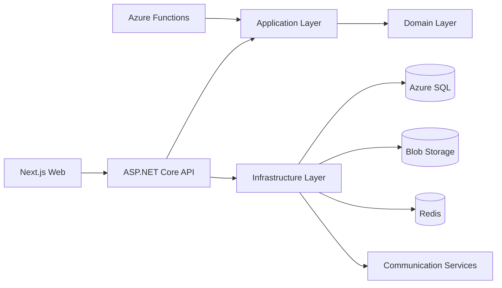

# Architecture Overview

The system is a cloud-native SaaS application for non-profit donation operations. The frontend is a Next.js app, the backend is an ASP.NET Core API using Clean Architecture, and background work runs in Azure Functions.

## Azure Service Map

- Azure Front Door: global HTTPS entry point and routing.
- Azure App Service: hosts the Next.js frontend and ASP.NET Core API.
- Azure Functions: scheduled recurring donation processing, receipt generation, notifications, and exports.
- Azure SQL Database: normalized transactional store.
- Azure Blob Storage: receipt PDFs, exported reports, uploaded media.
- Azure Redis Cache: dashboard cache, campaign cache, rate-limit state.
- Azure Communication Services: email and SMS notifications.
- Azure Key Vault: secrets, connection strings, payment provider keys.
- Application Insights and Azure Monitor: logs, metrics, traces, alerts.

## Clean Architecture

## Security

Azure AD B2C issues JWTs. The API validates issuer, audience, expiry, and role claims. Authorization policies map to Donor, Volunteer, Treasurer, Campaign Manager, and Admin permissions.

