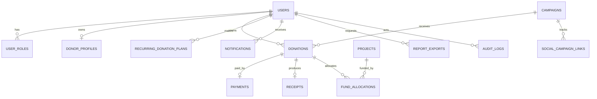

# Database Schema

## ER Diagram

## Tables

- Users: external identity ID, email, display name, phone, active flag.
- UserRoles: user ID and role name, unique per user.
- DonorProfiles: address and communication preferences.
- Campaigns: name, slug, story, goal, raised amount, status, date range, media.
- Projects: code, description, funding goal, allocated amount, active flag.
- Donations: donor, campaign, recurring plan, amount, currency, status.
- RecurringDonationPlans: donor, campaign, amount, frequency, next run, status.
- Payments: provider, reference, amount, currency, status.
- FundAllocations: donation, project, amount.
- Receipts: donation, receipt number, status, blob URL, sent timestamp.
- Notifications: user, channel, status, subject, body.
- AuditLogs: actor, action, entity type, entity ID, metadata, IP.
- ReportExports: requester, report type, status, blob URL.
- SocialCampaignLinks: platform URL and tracking code.

## Indexes

- Users: email, external identity ID.
- Donations: donor/date, campaign/date, status.
- Payments: provider reference, status.
- Campaigns: slug, status/date range.
- AuditLogs: actor/entity/date.

