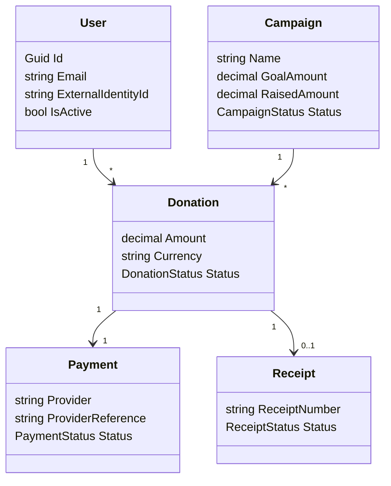

# Class Diagram

```mermaid
classDiagram
  class User {
    Guid Id
    string Email
    string ExternalIdentityId
    bool IsActive
  }
  class Campaign {
    string Name
    decimal GoalAmount
    decimal RaisedAmount
    CampaignStatus Status
  }
  class Donation {
    decimal Amount
    string Currency
    DonationStatus Status
  }
  class Payment {
    string Provider
    string ProviderReference
    PaymentStatus Status
  }
  class Receipt {
    string ReceiptNumber
    ReceiptStatus Status
  }
  User "1" --> "*" Donation
  Campaign "1" --> "*" Donation
  Donation "1" --> "1" Payment
  Donation "1" --> "0..1" Receipt
```

