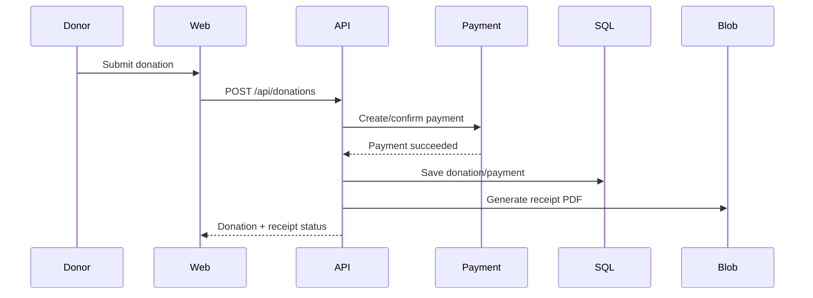
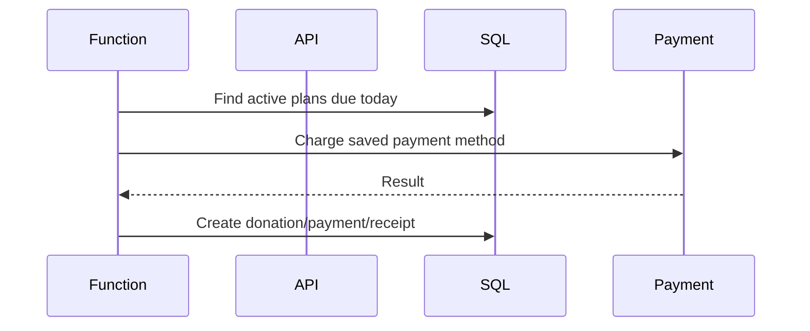
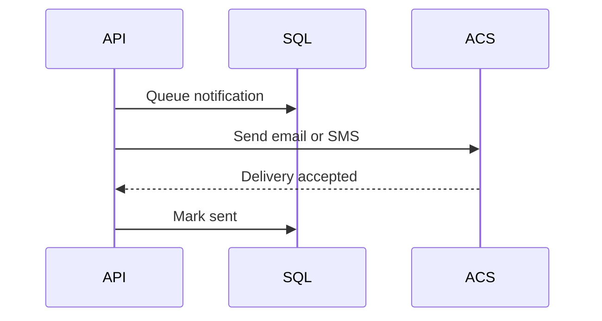

# Sequence Diagrams

## One-Time Donation

```mermaid
sequenceDiagram
  participant Donor
  participant Web
  participant API
  participant Payment
  participant SQL
  participant Blob
  Donor->>Web: Submit donation
  Web->>API: POST /api/donations
  API->>Payment: Create/confirm payment
  Payment-->>API: Payment succeeded
  API->>SQL: Save donation/payment
  API->>Blob: Generate receipt PDF
  API-->>Web: Donation + receipt status
```

## Recurring Donation

```mermaid
sequenceDiagram
  participant Function
  participant API
  participant SQL
  participant Payment
  Function->>SQL: Find active plans due today
  Function->>Payment: Charge saved payment method
  Payment-->>Function: Result
  Function->>SQL: Create donation/payment/receipt
```

## Notifications

```mermaid
sequenceDiagram
  participant API
  participant SQL
  participant ACS
  API->>SQL: Queue notification
  API->>ACS: Send email or SMS
  ACS-->>API: Delivery accepted
  API->>SQL: Mark sent
```

