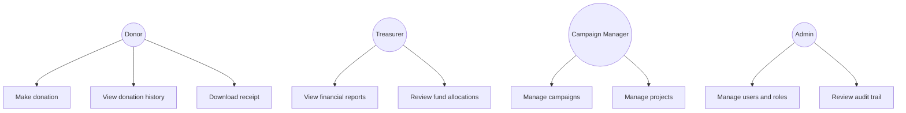

# Use Case Diagram

```mermaid
flowchart TB
  Donor((Donor))
  Treasurer((Treasurer))
  Manager((Campaign Manager))
  Admin((Admin))
  Donor --> Donate[Make donation]
  Donor --> History[View donation history]
  Donor --> Receipt[Download receipt]
  Treasurer --> Reports[View financial reports]
  Treasurer --> Allocation[Review fund allocations]
  Manager --> Campaigns[Manage campaigns]
  Manager --> Projects[Manage projects]
  Admin --> Users[Manage users and roles]
  Admin --> Audit[Review audit trail]
```

